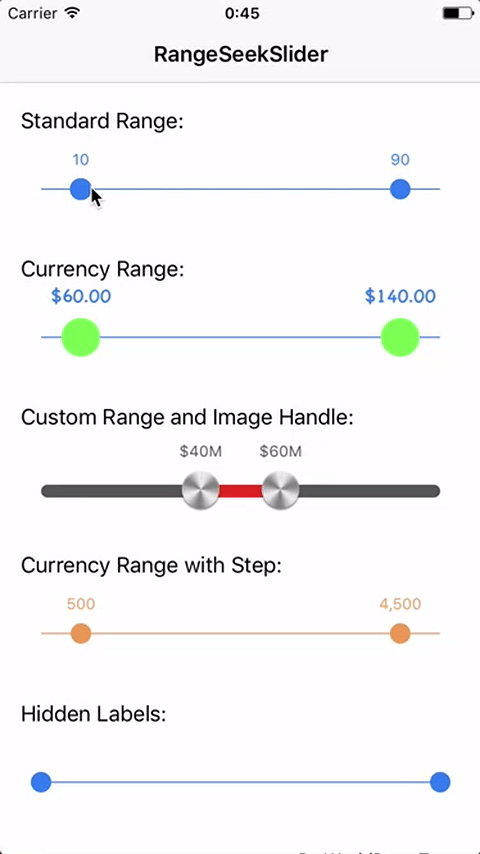
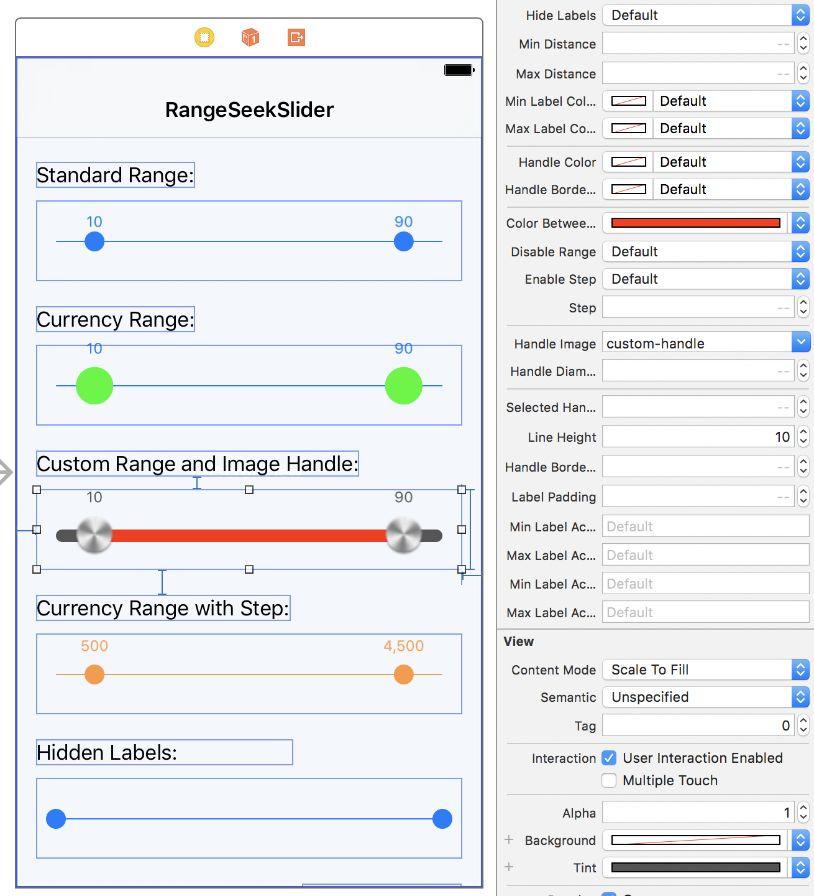

# RangeSeekSlider

[](https://gitter.im/WorldDownTown/RangeSeekSlider?utm_source=badge&utm_medium=badge&utm_campaign=pr-badge&utm_content=badge)

[](https://doge.mit-license.org)
[](https://developer.apple.com/swift)
[](https://github.com/Carthage/Carthage)
[](http://cocoadocs.org/docsets/RangeSeekSlider/)
[](http://cocoadocs.org/docsets/RangeSeekSlider/)

## Overview
`RangeSeedSlider` provides a customizable range slider like a UISlider.
This library based on [TomThorpe/TTRangeSlider](https://github.com/TomThorpe/TTRangeSlider) (Objective-C) and made with Swift.



## Demo
You can try on [Appetize.io](https://appetize.io/app/e5efvebtfp8750wmmvg2jh3emw)

or

Build Xcode project.

1. Open RangeSeekSlider.xcodeproj.
2. Change Scheme to `RangeSeekSliderDemo`
3. Run

## Usage
Add the RangeSeekSlider like you would with any other UIControl. Either:
- Add a view in your storyboard/class and change it’s type to `RangeSeekSlider`. You can set all the properties in the Attributes Inspector and see a live preview:



or

- Create the `RangeSeekSlider` in code using `RangeSeekSlider()` then add it as a subview to your code and set the relevant autolayout properties or frame.

The default slider ranges from 0.0 -> 100.0 and has 10.0 preselected as the minimum, and 90.0 as the maximum.

Values that the user has selected are exposed using the `selectedMinValue` and `selectedMaxValue` properties. You can also use these properties to change the selected values programatically if you wish.

Other customisation of the control is done using the following properties:

#### `tintColor`
The tintColor property (which you can also set in Interface Builder) sets the overall color of the control, including the color of the line, the two handles, and the labels.

It is safe to change the `tintColor` at any time, if the control is currently visible the color change will be animated into the new color.

#### `minValue`
The minimum possible value to select in the range

#### `maxValue`
The maximum possible value to select in the range

#### `selectedMinValue`
The preselected minumum value (note: This should be less than the selectedMaxValue)

#### `selectedMaxValue`
The preselected maximum value (note: This should be greater than the selectedMinValue)

#### `minLabelFont`
The font of the minimum value text label. If not set, the default is system font size `12.0`.

#### `maxLabelFont`
The font of the maximum value text label. If not set, the default is system font size `12.0`.

#### `numberFormatter`
Each handle in the slider has a label above it showing the current selected value. If you change number format, update each properties of `NumberFormatter`. By default, this is displayed as a decimal format.

#### `hideLabels`
When set to `true` the labels above the slider controls will be hidden. Default is false.

#### `minDistance`
The minimum distance the two selected slider values must be apart. Default is `0.0`.

#### `maxDistance`
The maximum distance the two selected slider values must be apart. Default is `CGFloat.greatestFiniteMagnitude`.

#### `minLabelColor`
The color of the minimum value text label. If not set, the default is the tintColor.

#### `maxLabelColor`
The color of the maximum value text label. If not set, the default is the tintColor.

#### `handleColor`
If set it will update the color of the handles. Default is `tintColor`.

#### `colorBetweenHandles`
The colorBetweenHandles property sets the color of the line between the two handles.

#### `handleBorderColor`
If set it will update the color of the handle borders. Default is `tintColor`.

#### `disableRange`
If true, the control will mimic a normal slider and have only one handle rather than a range.

In this case, the selectedMinValue will be not functional anymore. Use selectedMaxValue instead to determine the value the user has selected.

#### `enableStep`
If true the control will snap to point at each `step` (property) between minValue and maxValue. Default value is disabled.

#### `step`
If `enableStep` is true, this controls the value of each step. E.g. if this value is 20, the control will snap to values 20,40,60...etc. Set this is you enable the `enableStep` property.

#### `handleImage`
If set the image passed will be used for the handles.

#### `handleDiameter`
If set it will update the size of the handles. Default is `16.0`.

#### `selectedHandleDiameterMultiplier`
If set it update the scaling factor of the handle when selected. Default is `1.7`. If you don't want any scaling, set it to `1.0`.

#### `lineHeight`
Set the height of the line. It will automatically round the corners. If not specified, the default value will be `1.0`.

#### `handleBorderWidth`
If set it will update the size of the handle borders. Default is `0.0`

#### `labelPadding`
If set it will update the size of the padding between label and handle. Default is `8.0`

#### `minLabelAccessibilityLabel`
The label displayed in accessibility mode for minimum value handler. If not set, the default is empty String.

#### `maxLabelAccessibilityLabel`
The label displayed in accessibility mode for maximum value handler. If not set, the default is empty String.

#### `minLabelAccessibilityHint`
The brief description displayed in accessibility mode for minimum value handler. If not set, the default is empty String.

#### `maxLabelAccessibilityHint`
The brief description displayed in accessibility mode for maximum value handler. If not set, the default is empty String.

## Requirements
- Swift 3.0+
- iOS 9.0+

## Installation

### Carthage
RangeSeekSlider is available through [Carthage](https://github.com/Carthage/Carthage). To install it, simply add the following line to your Cartfile:

```
github "WorldDownTown/RangeSeekSlider"
```

### CocoaPods
RangeSeekSlider is available through [CocoaPods](http://cocoapods.org). To install it, simply add the following line to your Podfile:

```ruby
pod 'RangeSeekSlider'
```

### Manually
Download and drop `RangeSeekSlider/Sources` folder in your project.

## Author
WorldDownTown, WorldDownTown@gmail.com

## License
RangeSeekSlider is available under the MIT license. See the LICENSE file for more info.

